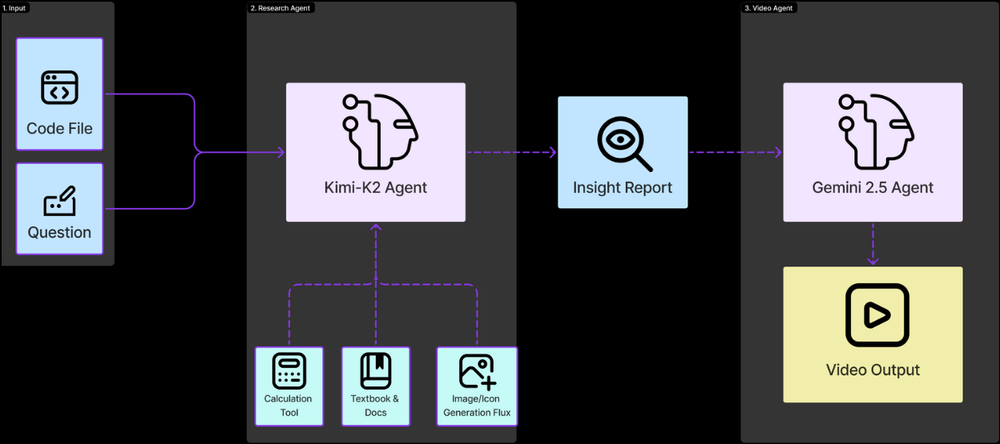

# VisoCode

> 🙋‍♂️➡️🎞️ VisoCode turns questions into cinematic explanations—powered by AI agents, rendered with Manim.

---
### 🧠 Overview

VisoCode is an **AI-powered explainer engine** that transforms questions into **expert-level animated videos** using a multi-agent pipeline. Whether you're curious about medical AI, calculus or the code base in front of you, Visocode gives you not just an answer, but an explanation you can **see**.

▶️ [Watch the demo video](https://github.com/user-attachments/assets/7b855524-8190-46c3-be1a-6a4bda1dd74d)

---

### 🔄 How It Works

1. 🙋‍♂️ **You ask a question**
2. 🧠 **ResearchAgent** (powered by **Kimi-K2**) builds an expert explanation using:
   - 🔍 arXiv search
   - 🧮 math/calculation tools
   - 🖼️ icon generation
   - 🧾 structured metadata (sections, visuals, references)
3. 📤 The explanation and metadata are passed to a second agent...
4. 💻 **CodeAgent** (powered by **Gemini**) turns that explanation into:
   - 🎬 Writes frame-accurate Manim scene code
   - 📐 Converts math into LaTeX-rendered visuals
   - 🧩 Coordinates  icons, timing, and transitions for clarity
5. 🎞️ **Final Output**: A polished Manim animation that visualizes your question with expert clarity.



---

### 🚀 Why VisoCode?

- ✨ **Visual-first learning**: Abstract concepts come to life through animation  
- 🔗 **Agent-powered pipeline**: Separates research and rendering for modularity, traceability, and full control 
- ⚡ **Fast, automated output**: From natural language to video in minutes
- 🧠 **Research-grade insight**: Built on real scientific search + analysis

---

### 💡 Who Is It For?

- 👩‍💻 **Developers** exploring unfamiliar systems or concepts  
- 🎓 **Students** reviewing math, physics, CS, and more  
- 👨‍🏫 **Teachers** designing custom visual explanations  
- 📹 **Content creators** automating technical YouTube videos

---

VisoCode isn’t just a tool. It’s a **thinking partner** and **video studio**, all in one intelligent pipeline.

---

# Installation

1. Windows 11 (TODO: support other OS by isolating Windows-specific actions in some microservice)
2. [Git](https://git-scm.com/downloads)
3. [Python >=3.11.6, <3.12](https://www.python.org/downloads/release/python-3116/)
4. [VapourSynth R65](https://github.com/vapoursynth/vapoursynth/releases/tag/R65)
5. [uv](https://docs.astral.sh/uv/getting-started/installation/)
6. [Manim](https://docs.manim.community/en/stable/installation/uv.html)
   - Install a LaTeX distribution as well
7. [ffmpeg](https://ffmpeg.org/download.html)
   - Add executable to path
8. [tex-fmt](https://github.com/WGUNDERWOOD/tex-fmt)
   - Installation involves cargo, the Rust package manager
   - Make sure executable is in path
9. [VS Code](https://code.visualstudio.com/) or a fork like [Cursor](https://cursor.com/en)
10. Clone the repo
11. Open in VS Code
12. Install recommended extensions in `.vscode/extensions.json`
13. Create and populate `.env` following `.env.example`
14. ```console
    uv sync
    ```
15. Activate venv
